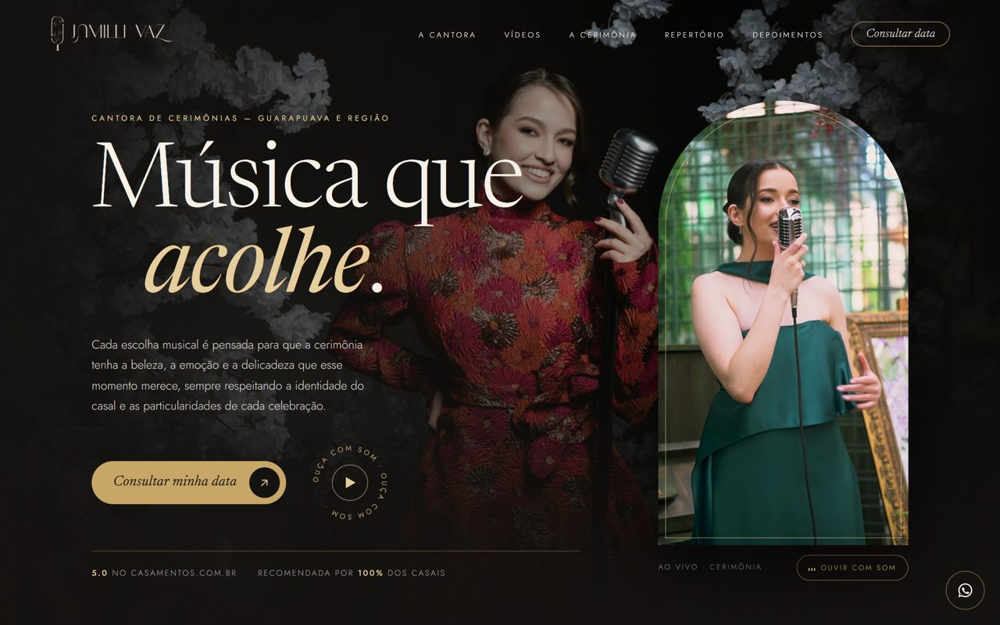

# Site da Jamilli Vaz

Site da Jamilli Vaz, cantora de cerimônias de casamento em Guarapuava (PR) e região.
**No ar:** https://jamillivaz.com.br

| Computador | Celular |
|---|---|
|  |  |

## O que o site faz

- **Abertura em vídeo** com a voz dela ao vivo, e botão para ouvir com som.
- **Filmes de cerimônias reais**, que abrem em tela cheia.
- **Como funciona o dia**, **repertório** e **depoimentos** de casais.
- **Consultar data** direto no WhatsApp, com a mensagem já escrita.
- **Propostas por casal:** cada casal recebe um link próprio com três opções (da mais simples à completa) e os valores.
- **Painel com senha** para a cantora: agenda, propostas, contatos, financeiro (sinal e restante) e um resumo do dia.
- **Pensado para o Google:** título e descrição por página, dados estruturados (schema.org), sitemap e domínio próprio.

## Como foi feito

- HTML, CSS e JavaScript puro, sem framework, publicado no GitHub Pages com o domínio `jamillivaz.com.br`.
- As propostas e o painel conversam com uma API em Cloudflare Worker + banco D1 (código fora deste repositório). A versão genérica do mesmo sistema é pública em [JoaoVitorRk/painel-propostas](https://github.com/JoaoVitorRk/painel-propostas).
- Fotos e vídeos são o material real da cantora, otimizados para carregar rápido no celular.
- Construído com apoio do Claude Code: eu defino o que o site precisa fazer, testo no computador e no celular e reviso o resultado.

Feito pela [RK Performance](https://rkperformance.com.br) · [João Vitor Raifur Kos](https://www.linkedin.com/in/joao-vitor-raifur-kos).
Fotos, vídeos, textos e marca pertencem à Jamilli Vaz.
